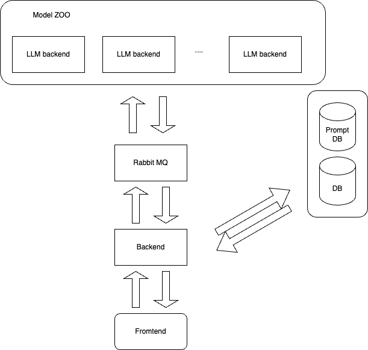

# Модель генерации продающих тесктов 

## Исследуемые модели:
** все модели общедоступны
- [ ] [saiga2 7b](https://huggingface.co/IlyaGusev/saiga2_7b_gguf)
- [ ] [saiga2 13b](https://huggingface.co/IlyaGusev/saiga2_13b_gguf)
- [ ] [saiga_mistral 7b](https://huggingface.co/IlyaGusev/saiga_mistral_7b_gguf)
- [ ] [RWKV](https://github.com/BlinkDL/RWKV-LM) / [RWKV-5](https://huggingface.co/BlinkDL/rwkv-5-world/tree/main)
- [ ] [miniGPT4](https://github.com/Maknee/minigpt4.cpp)
- [ ] [ruGPT3.5](https://huggingface.co/ai-forever/ruGPT-3.5-13B)
- [ ] [xglm-7.5](https://huggingface.co/facebook/xglm-7.5B)
- [ ] [T5](https://huggingface.co/IlyaGusev/fred_t5_ru_turbo_alpaca)

## Подходы к решению задач
- [ ] few-shot
- [ ] Retrieval Augmented Generation

## Инференс моделей
- [ ] квантизация
- [ ] [gglm](https://github.com/ggerganov/ggml)
- [ ] raw inference (as is)
- [ ] docker

## Архитектура приложения:

